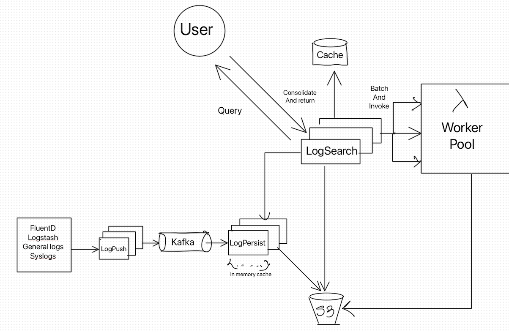

# Event Storage System
A micro-service based project which uses serverless compute to retrieve and search data from object storage like S3.

[Project Documentation](https://drive.google.com/file/d/1XUzXbl59cbNiDq2CCOysHPKWMzEyuUAa/view?usp=sharing)

## System Architecture
